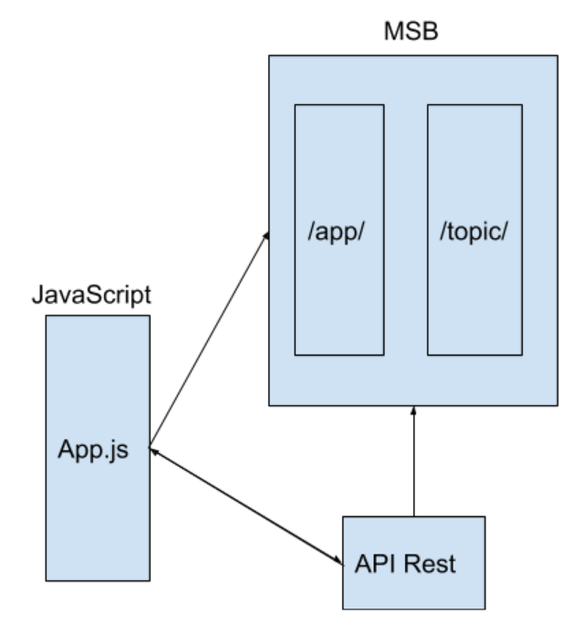
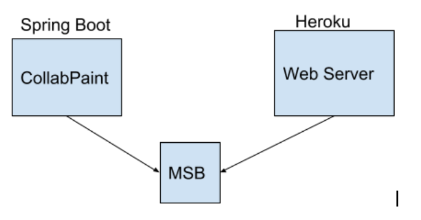

### Escuela Colombiana de Ingeniería
### Arquitecturas de Software - ARSW
### Laboratorio - Broker de Mensajes STOMP con WebSockets + HTML5 Canvas.

LINK HEROKU: https://messagebrokerarsw.herokuapp.com/

La arquitectura de este laboratorio esta basado en un Broker de mensajes STOMP, en el que eventos en canvas son enviados a una cola (app/newpoint) en el message handler y este a su vez los redirecciona a la cola correspondiente de cada dibujo, igualmente en el MSB se lleva el conteo del numero de puntos registrados en cada dibujo de forma colaborativa, para asi, formar poligonos en el canvas.

